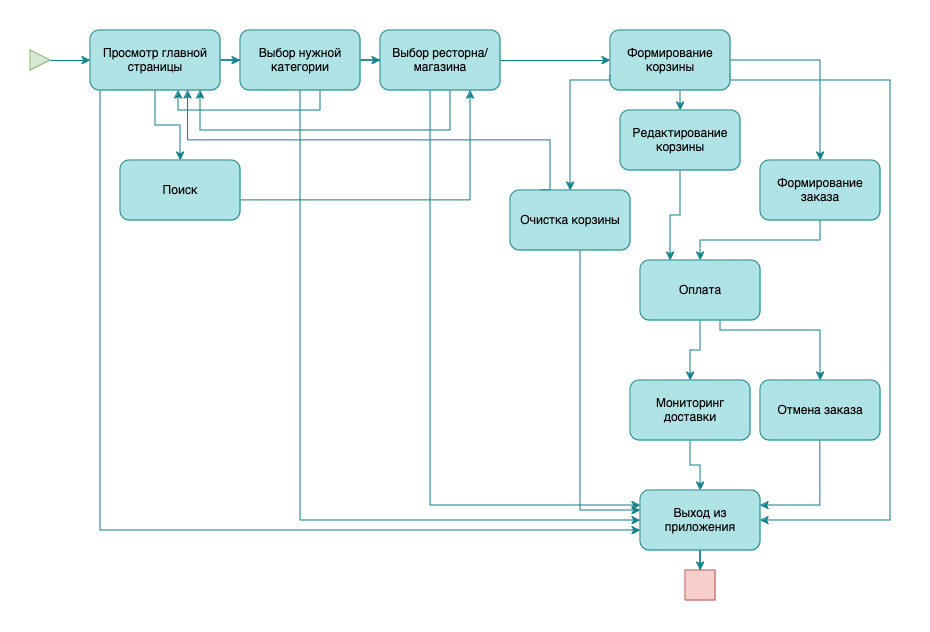
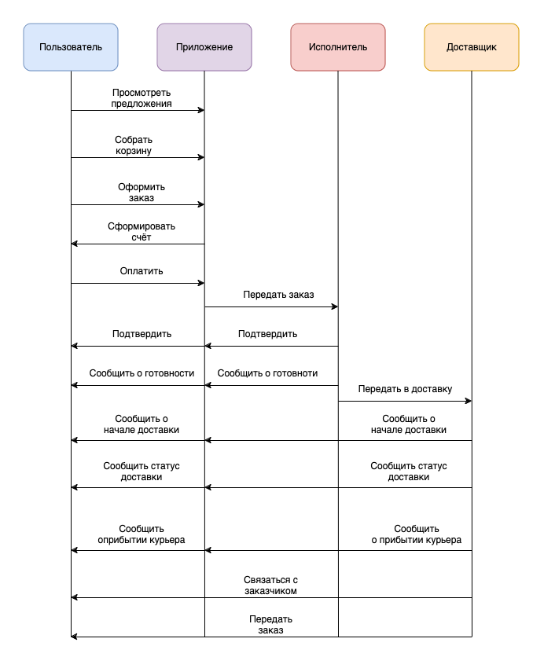
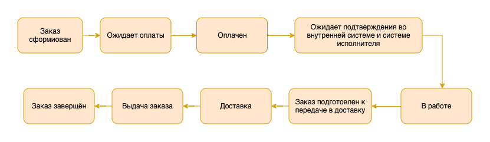
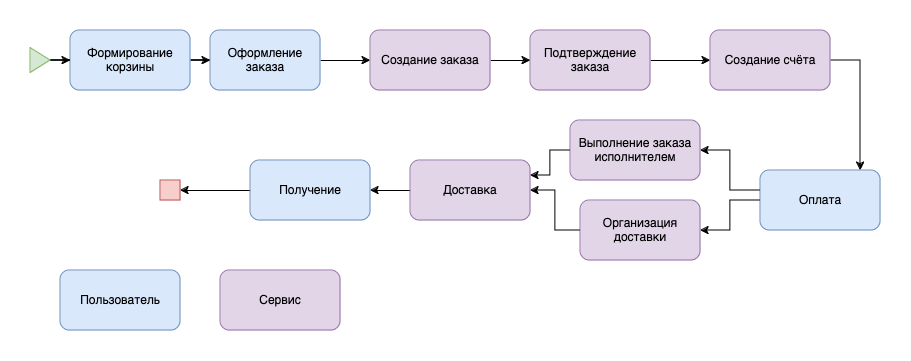
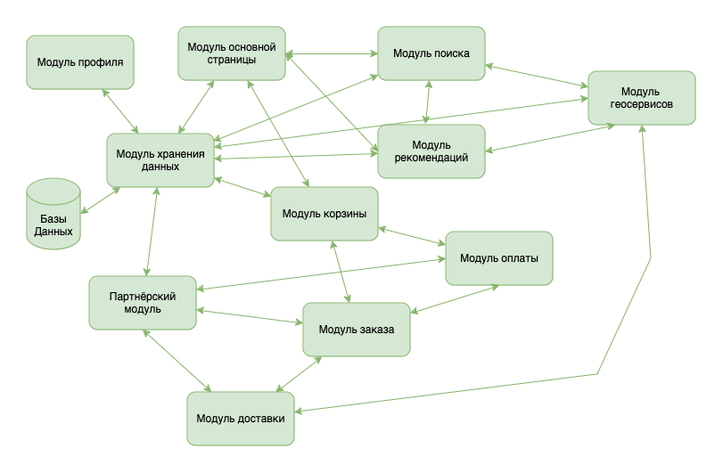

# FoodDelivery

## Описание системы

FoodDelivery - это приложение для выбора заказа и доставки еды из ресторанов и продуктов из магазинов.

Система состоит из нескольких модулей, взаимодействующих друг с другом.

### Модуль главной страница

Осуществляет работу ленты, куда пользователь направляется при открытии сервиса.

Лента содержит седующие блоки:

- Блок с новостями и ациями

- Блок с подбороками

- Блок с лентой рекомендаций

- Блок с лентой рекламыми предложенями (может быть объединён с рекомендациями)

- Дополнительная информация (например последние заказы)

### Модуль поиска

Осуществляет поиск с помощью фильтров и ключевых слов в каталоге для подбора наиболее подходящих предложений.

### Модуль рекомендаций

Осуществляет формирования списка рекомендаций в основном модуле, поиске и прочих.

### Модуль корзины

Осуществляет работу со список выбрнных товаров и услуг, адаптирующаяся к изменениям таких параметров, как время, наличие товара, геолокация пользователя и т.д. Содержит механизм перехода к модулю создания заказа.

### Модуль заказа

Формирует заказ на основе корзины, подтверждает заказ в системе и у исполнитля с дальнейшим переводом в состояния ожидания оплаты. После оплаты передаёт заказ в работу и в модуль доставки. От момента передачи заказа в работу до получния заказа следит за статусом заказа и осуществляет взаимодействие между модулем оставки и пользователем. Также осуществляет взаимодействие с партнёрским модулем.

### Модуль оплаты

Осуществляет оплату заказа. Взаимодейтует с модулем заказа и внешними платёжными сервисами. Предоставляет возможность выбора способа оплаты, проивозводит оплату, посредствам взаимодействия с платёжными системами, после чего передаёт подтверждение оплаты модулю заказа. Также, производит расчёт сервиса с исполниьелем.

### Модуль доставки

Модуль остуществляющий подбор подходящего курьера и сопровождение доставки заказа. Взаимодействует с геосервисами и партнёрским модулем.

### Модуль геосервисов

Необходим для поиска курьера в подходящей зоне, фильтрации предложений, построения пути доатавки и т.п.

### Партнёрский модуль

Осуществляет взаимодействие сервиса с внешними исполнителями, такими как рестораны, магазины и т.п. Через этот модуль просходит поддержка каталога товаров и услуг исполнителя заказа, а так же взаимодействие с исполниелем при выполнении заказа.

### Модуль профиля пользователя

Осуществляет авторизацию пользователя, взаимодействие с его персональными данными и платёжными данными, а также дополнительную информацию, такую как персональные скидки, купоны и прочее. Кроме того, хранит данные для рекомендаций.

### Модуль хранения данных

Хранит все данные и позволяет остальным модулям получать эти данные с учётом фильтраций по геоданным, данным пользователя и прочим данным.

## Диаграмма вариантов использования

## Диаграмма последовательности заказа

## Диаграмма состояний заказа

## Диаграмма деятельности

## Диаграмма классов

